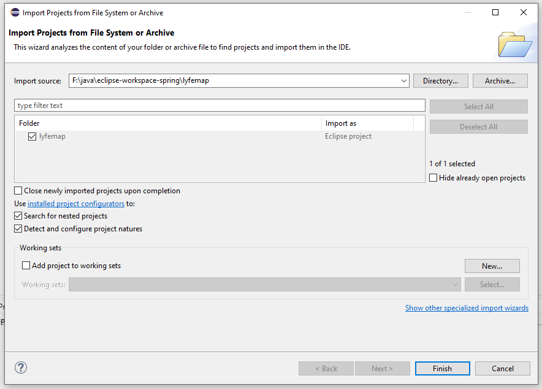

Para dar início ao projeto em sua máquina deverá seguir alguns passos para sua instalação.

### Processos


__1º__ - Dar um clone do projeto na pasta que deseja;

``` js
git clone https://github.com/JeanCigoli/Bank-Transaction.git
```


__2º__ - Abrir o projeto dentro do eclipse ou a IDE de sua utilização e esperar baixar as dependências;



* __Obs.:__ Exemplo utilizando a IDE Eclipse


__3º__ - Iniciar a aplicação.