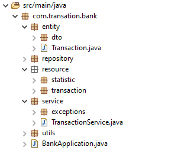
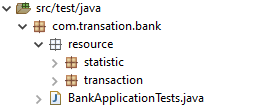

## Estrutura de pastas

Existem duas estruturas, a estrutura da aplicação e dos testes:

### Aplicação

#### Entity

Onde é armazenado as classes / modelos da minha aplicação. Classes representativas do meu banco de dados.

Dentro de dto é armazenada as classes que ajudaram na transferência de dados.

#### Repository

Onde é criada a interface que irá ter a configuração do hibernate para nos ajudar nas query do banco.

#### Resource

Onde é armazenado os recursos da aplicação, o que ficará disponível para acesso de fora.

#### Service

Alguns serviços que será utilizado pela aplicação, como arquivos que servirá de ponte entre os recursos e os repositórios, ou arquivos que ajudará em exceções que possam ocorrer.

#### Utils

E por último as funções que serviram de apoio para alguns lugares da aplicação.

### Testes

#### Resource

Onde é armazenado os recursos da aplicação que passaram por testes, assim testando deste de o envio do json a rota até verificando o retorno de resposta.